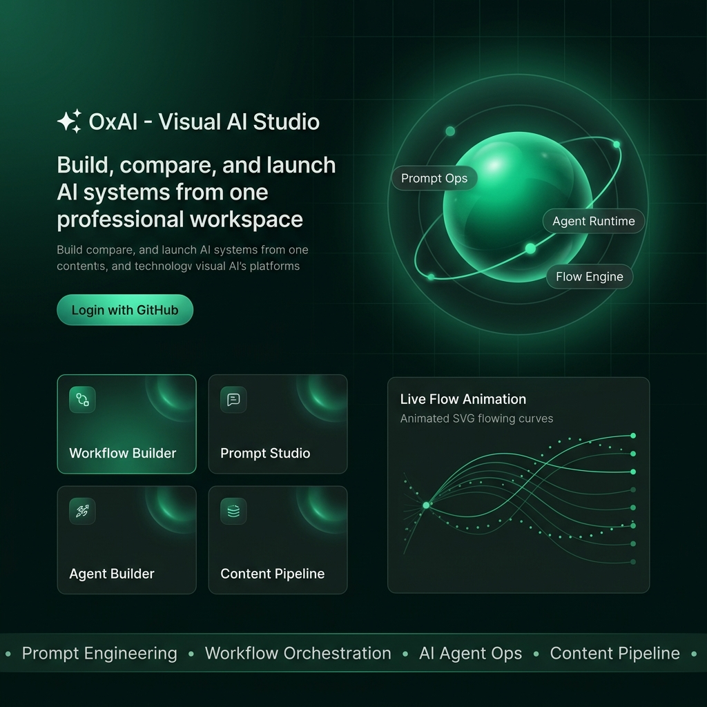
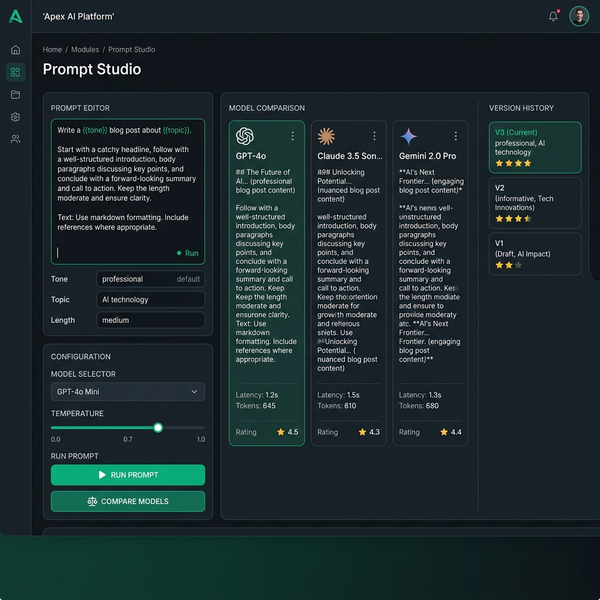
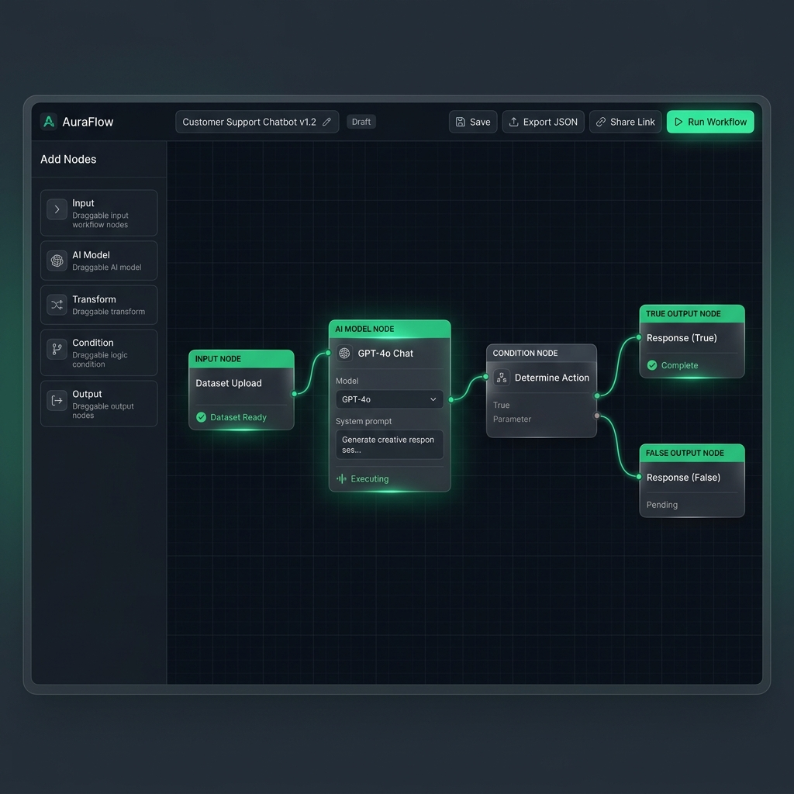
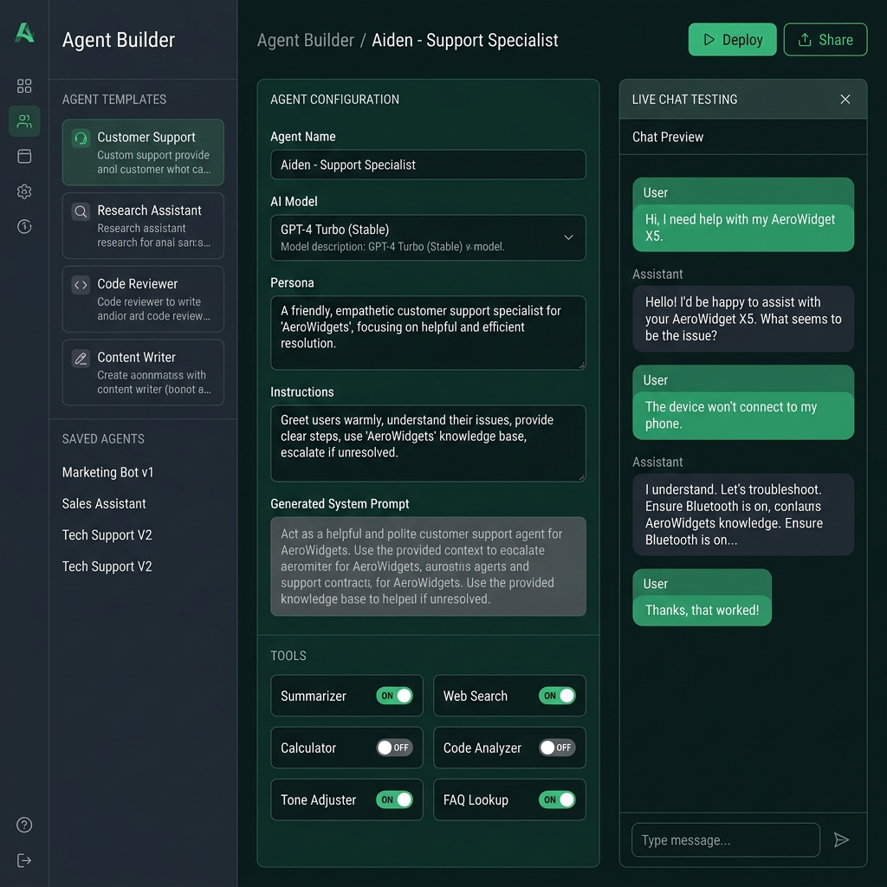
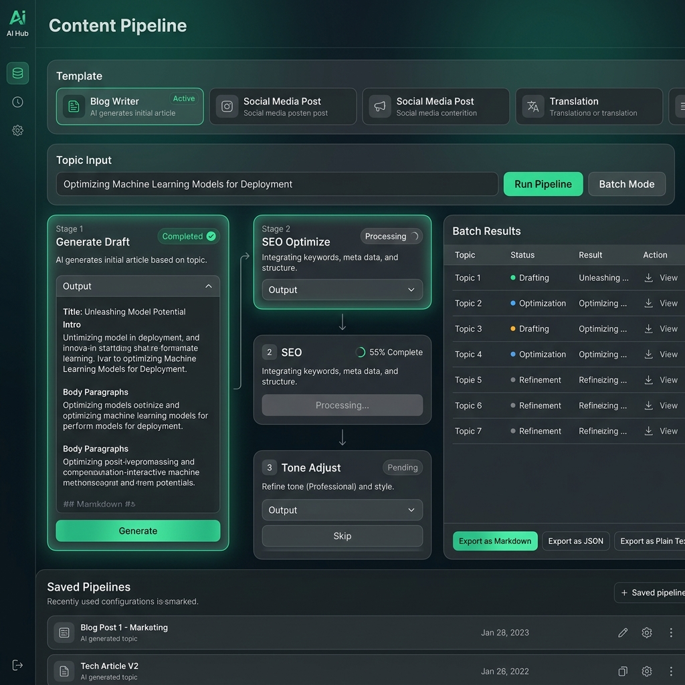
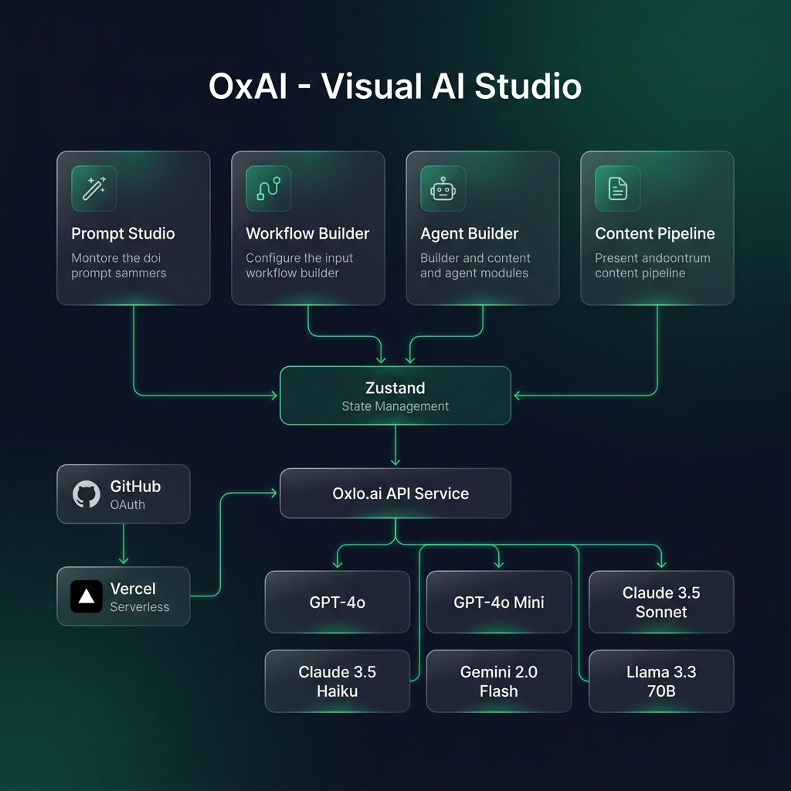
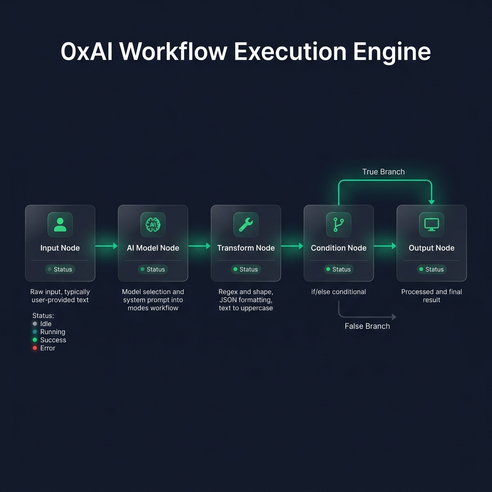
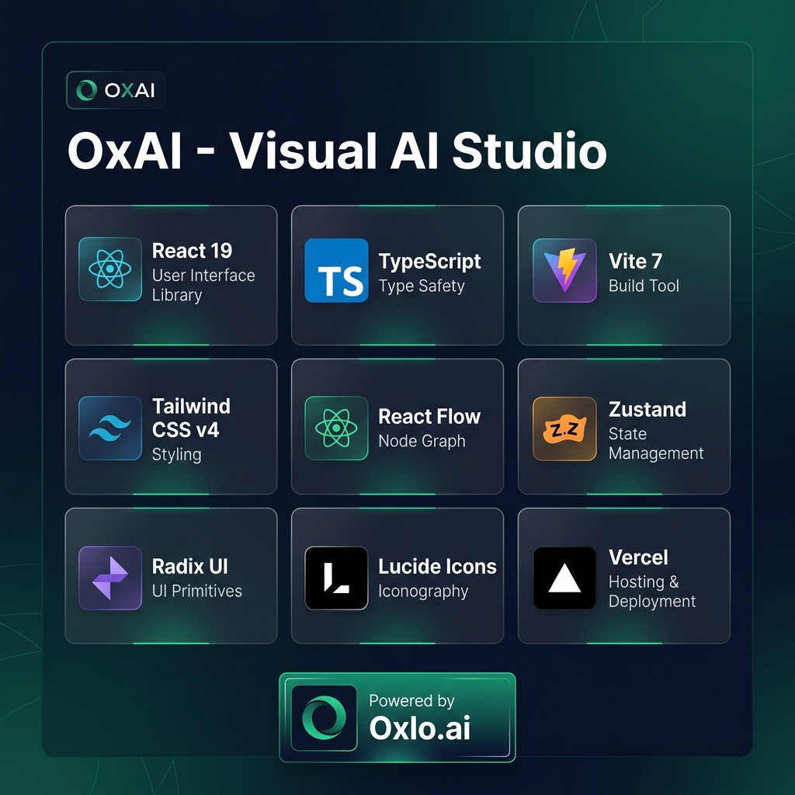

<p align="center">
  
</p>

<h1 align="center">OxAI - Visual AI Studio</h1>

<p align="center">
  <strong>Build, compare, and launch AI systems from one professional workspace.</strong>
</p>

<p align="center">
  <a href="https://oxai-puce.vercel.app">Live Demo</a> |
  <a href="#core-modules">Features</a> |
  <a href="#architecture">Architecture</a> |
  <a href="#quick-start">Quick Start</a> |
  <a href="#tech-stack">Tech Stack</a> |
  <a href="#oxloai-models">Models</a>
</p>

<p align="center">
  
  
  
  
  
  
</p>

---

## Table of Contents

- [About](#about)
- [Real-World Use Case](#real-world-use-case)
- [Live Demo](#live-demo)
- [Core Modules](#core-modules)
  - [Prompt Studio](#1-prompt-studio)
  - [Workflow Builder](#2-workflow-builder)
  - [Agent Builder](#3-agent-builder)
  - [Content Pipeline](#4-content-pipeline)
- [Architecture](#architecture)
- [Workflow Execution Engine](#workflow-execution-engine)
- [Tech Stack](#tech-stack)
- [Oxlo.ai Models](#oxloai-models)
- [Quick Start](#quick-start)
- [Deployment](#deployment)
- [GitHub Login Setup](#github-login-setup)
- [Project Structure](#project-structure)
- [Sharing and Embed](#sharing-and-embed)
- [Hackathon Info](#hackathon-info)
- [License](#license)

---

## About

**OxAI** is a browser-based AI Studio that lets anyone -- developer or non-technical user -- visually build, test, version, and deploy AI workflows and agents without infrastructure complexity.

Users drag, connect, and configure AI-powered nodes on a canvas, then run them instantly using **Oxlo.ai's unified multi-model API**. Think of it as a combination of **n8n + PromptLayer + Flowise**, but leaner, faster, and fully powered by Oxlo.ai.

### Why OxAI?

Building AI-powered applications today requires juggling multiple tools:

| Problem | OxAI Solution |
|---------|---------------|
| One tool to write and test prompts | **Prompt Studio** -- write, compare, version, and rate |
| Another to chain models together | **Workflow Builder** -- visual drag and drop canvas |
| Another to manage AI agents | **Agent Builder** -- persona, tools, deploy in one click |
| Another to run content pipelines | **Content Pipeline** -- batch generation with export |

**OxAI unifies all of this in a single, zero-setup, browser-first experience.**

---

## Real-World Use Case

Teams can prototype and test AI automations without backend setup:

- **Marketing Teams** -- Batch-generate blog posts, social media content, and translations
- **Developers** -- Build and test multi-step AI workflows with condition logic
- **Product Managers** -- Compare model performance side-by-side for better decisions
- **Support Teams** -- Deploy custom AI agents with FAQ and tool routing
- **Content Creators** -- Run multi-stage content pipelines with SEO optimization

---

## Live Demo

> **Production URL:** [https://oxai-puce.vercel.app](https://oxai-puce.vercel.app)
>
> Latest deployment: April 2, 2026

---

## Core Modules

### 1. Prompt Studio

<p align="center">
  
</p>

The Prompt Studio is a full-featured prompt engineering environment with multi-model comparison:

| Feature | Description |
|---------|-------------|
| **Variable Templating** | Use `{{variable}}` syntax for dynamic prompts with auto-detection |
| **Single Model Run** | Execute prompt on any Oxlo model with configurable temperature |
| **Model Comparison** | Run same prompt on 2-3 models simultaneously, compare side-by-side |
| **Version History** | Save, name, load, and delete prompt versions |
| **Version Diff Viewer** | Line-by-line diff comparison between any two saved versions |
| **Prompt Rating** | Rate outputs 1-5 stars, auto-track best-performing version |
| **Model Health Check** | Ping all 6 configured models to verify API connectivity |
| **Keyboard Shortcuts** | Ctrl+Enter to run, Ctrl+S to save version |

---

### 2. Workflow Builder

<p align="center">
  
</p>

A visual drag-and-drop workflow canvas powered by React Flow:

| Feature | Description |
|---------|-------------|
| **5 Node Types** | Input, AI Model, Transform, Condition, Output |
| **Drag and Drop** | Drag nodes from palette onto canvas |
| **Visual Connections** | Connect nodes with animated emerald edges |
| **Topological Execution** | Smart graph traversal with per-node status tracking |
| **Condition Branching** | If/else routing with true/false output handles |
| **Per-Node Results** | Each node shows its output, errors, or skip reason |
| **Workflow Management** | Save, load, duplicate, delete, rename workflows |
| **Export JSON** | Download workflow as a portable JSON file |
| **Share Link** | Generate shareable Base64-encoded URL |
| **Circular Dependency Detection** | Prevents infinite execution loops |

---

### 3. Agent Builder

<p align="center">
  
</p>

Build and deploy AI agents with persona configuration and tool routing:

| Feature | Description |
|---------|-------------|
| **4 Templates** | Customer Support, Research Assistant, Code Reviewer, Content Writer |
| **Persona and Instructions** | Define personality and behavioral guidelines |
| **6 Tools** | Summarizer, Web Search, Calculator, Code Analyzer, Tone Adjuster, FAQ |
| **Tool Trace Display** | See which tools were triggered and their outputs |
| **Multi-Turn Chat** | Full conversation context sent with each message |
| **Auto System Prompt** | Generated from persona + instructions + enabled tools |
| **One-Click Deploy** | Generate shareable agent link |
| **Embeddable Widget** | Copy iframe snippet for any website |
| **Agent Save/Load** | Persist configurations to browser storage |

---

### 4. Content Pipeline

<p align="center">
  
</p>

Multi-stage content generation pipeline with batch processing:

| Feature | Description |
|---------|-------------|
| **Pipeline Templates** | Blog Writer, Social Media, Translation |
| **Custom Stages** | Add/remove/reorder generation stages with custom prompts |
| **Stage-by-Stage Execution** | Live output display as each stage completes |
| **Batch Mode** | Process multiple topics from manual input or CSV upload |
| **Export Formats** | Markdown, JSON, or Plain Text |
| **Pipeline Save/Load** | Persist reusable pipelines in browser storage |

---

## Architecture

<p align="center">
  
</p>

### System Architecture

```
+------------------------------------------------------------------+
|                    Browser Client (React 19)                      |
|                                                                    |
|  +-------------------+  +-------------------+                     |
|  | Landing Page      |  | App Router        |                     |
|  | GitHub OAuth Login |  | Lazy Loading      |                     |
|  +-------------------+  | Hash Routing      |                     |
|                          +-------------------+                     |
|                                  |                                 |
|  +------------+  +------------+  +------------+  +------------+   |
|  | Prompt     |  | Workflow   |  | Agent      |  | Content    |   |
|  | Studio     |  | Builder    |  | Builder    |  | Pipeline   |   |
|  +------------+  +------------+  +------------+  +------------+   |
|                          |                                         |
|              +-----------------------+                             |
|              | Zustand State Store   |                             |
|              | (localStorage persist)|                             |
|              +-----------------------+                             |
+------------------------------------------------------------------+
                           |
              +------------------------+
              |    Service Layer       |
              |                        |
              |  oxloApi.ts            |
              |  githubAuth.ts         |
              +------------------------+
                     |            |
          +----------+            +----------+
          |                                  |
+-----------------+              +-------------------+
| Oxlo.ai API     |              | Vercel Serverless |
| /v1/chat/       |              | api/auth/github/  |
| completions     |              | exchange.js       |
+-----------------+              +-------------------+
  |  |  |  |  |  |                        |
  6 AI Models                     +---------------+
  (see below)                     | GitHub OAuth  |
                                  +---------------+
```

### Data Flow

```
User --> OxAI UI --> Zustand Store --> Oxlo.ai API
                                          |
                                          v
                                   Model Response
                                   (content + tokens + latency)
                                          |
                                          v
                               Store Results --> Display Output
```

**Step-by-step:**

1. User enters prompt or configures workflow in OxAI UI
2. UI updates Zustand state
3. User clicks Run / Execute
4. UI sends POST to Oxlo.ai `/v1/chat/completions`
5. API returns model response with content, token count, and latency
6. UI stores results and displays output with metrics

---

## Workflow Execution Engine

<p align="center">
  
</p>

The Workflow Builder includes a production-grade execution engine:

```
Input Node --> AI Model Node --> Transform Node --> Condition Node
                                                       |
                                              +--------+--------+
                                              |                 |
                                         [TRUE branch]    [FALSE branch]
                                              |                 |
                                         Output Node      Output Node
```

**Engine Features:**

- **Topological Sort** -- resolves node execution order from the graph structure
- **Blocked Edge Tracking** -- condition nodes block edges on the inactive branch
- **Skip Detection** -- nodes on blocked branches are marked as "skipped"
- **Error Isolation** -- a failing node does not crash the entire workflow
- **Circular Dependency Detection** -- breaks infinite loops gracefully
- **Live Status Updates** -- each node shows idle > loading > success / error / skipped

---

## Tech Stack

<p align="center">
  
</p>

| Layer | Technology | Purpose |
|-------|-----------|---------|
| **Framework** | React 19 + TypeScript 5.9 | UI components with strict type safety |
| **Build Tool** | Vite 7 | Lightning-fast HMR and optimized builds |
| **Styling** | Tailwind CSS v4 | Utility-first CSS with emerald dark theme |
| **Visual Canvas** | React Flow | Drag-and-drop workflow graph editor |
| **State Management** | Zustand | Lightweight store with localStorage persistence |
| **UI Primitives** | Radix UI (Dialog, Select, Tabs, Slot) | Accessible headless components |
| **Icons** | Lucide React | Consistent icon set |
| **Utilities** | CVA, clsx, tailwind-merge | Variant-based component styling |
| **Auth** | GitHub OAuth | Secure login with CSPRNG state validation |
| **Deployment** | Vercel | Edge-optimized hosting with serverless functions |
| **AI Backend** | Oxlo.ai API | Multi-model inference gateway |

### Build Output (Code Splitting)

```
dist/
  index.js          235 KB (74 KB gzip)   -- React + core framework
  flow.js           142 KB (46 KB gzip)   -- React Flow (lazy loaded)
  WorkflowBuilder    23 KB ( 6 KB gzip)   -- Lazy loaded
  PromptStudio       14 KB ( 4 KB gzip)   -- Lazy loaded
  ContentPipeline    14 KB ( 4 KB gzip)   -- Lazy loaded
  AgentBuilder       13 KB ( 5 KB gzip)   -- Lazy loaded
  icons              20 KB ( 8 KB gzip)   -- Lucide icons chunk
  state               7 KB ( 3 KB gzip)   -- Zustand chunk
  CSS (total)        74 KB (13 KB gzip)
```

---

## Oxlo.ai Models

OxAI is configured with **6 models** across 4 providers for comprehensive coverage:

| Model | Provider | Best For |
|-------|----------|----------|
| `gpt-4o` | OpenAI | High-quality reasoning and instruction following |
| `gpt-4o-mini` | OpenAI | Fast, cost-efficient everyday tasks |
| `claude-3-5-sonnet-20241022` | Anthropic | Nuanced writing and analysis |
| `claude-3-5-haiku-20241022` | Anthropic | Ultra-fast responses with good quality |
| `gemini-2.0-flash` | Google | Speed-optimized multimodal tasks |
| `llama-3.3-70b-versatile` | Meta | Open-source alternative with strong performance |

**Why this mix?**

- **Quality vs Speed profiles** -- users can compare response quality across tiers
- **Cost optimization** -- mini/haiku models for iteration, premium models for production
- **Model-fit testing** -- find the right model for each specific use case
- **Multi-model comparison** -- Prompt Studio runs the same prompt on 2-3 models simultaneously

---

## Quick Start

### Prerequisites

- [Node.js](https://nodejs.org/) v18+
- [npm](https://www.npmjs.com/) v9+
- Oxlo.ai API Key ([Get one here](https://oxlo.ai))

### Installation

```bash
# Clone the repository
git clone https://github.com/panzauto46-bot/OxAI.git
cd OxAI

# Install dependencies
npm install

# Start development server
npm run dev
```

The app will open at `http://localhost:5173`.

### With GitHub Login (requires Vercel CLI)

```bash
# Copy environment variables
cp .env.example .env

# Fill in your GitHub OAuth credentials
# VITE_GITHUB_CLIENT_ID=your_github_oauth_client_id
# GITHUB_CLIENT_SECRET=your_github_oauth_client_secret

# Run with Vercel dev for API routes
npx vercel dev
```

### Production Build

```bash
npm run build
npm run preview
```

---

## Deployment

### Deploy to Vercel

```bash
npx vercel --prod --yes
```

### Environment Variables (Vercel Dashboard)

| Variable | Description | Required |
|----------|-------------|----------|
| `VITE_GITHUB_CLIENT_ID` | GitHub OAuth App Client ID | Yes |
| `GITHUB_CLIENT_SECRET` | GitHub OAuth App Client Secret | Yes |

### Deployment Config (`vercel.json`)

```json
{
  "framework": "vite",
  "buildCommand": "npm run build",
  "outputDirectory": "dist"
}
```

---

## GitHub Login Setup

1. **Create a GitHub OAuth App** in [GitHub Developer Settings](https://github.com/settings/developers)
2. Set **Homepage URL** to your app URL
3. Set **Authorization callback URL** to your app root URL
4. Copy the **Client ID** and **Client Secret**
5. Set environment variables:
   - `VITE_GITHUB_CLIENT_ID` -- Client ID (exposed to frontend)
   - `GITHUB_CLIENT_SECRET` -- Client Secret (server-side only)

**Callback URLs:**

| Environment | URL |
|-------------|-----|
| Local | `http://localhost:3000/` (via `vercel dev`) |
| Production | `https://oxai-puce.vercel.app/` |

**Auth Flow:**

1. User clicks "Login with GitHub" on landing page
2. Redirected to GitHub OAuth authorization
3. GitHub redirects back with authorization code
4. Frontend sends code to `api/auth/github/exchange.js` (Vercel serverless)
5. Serverless function exchanges code for access token (client secret stays server-side)
6. Fetches user profile and primary email
7. Returns user data to frontend, stored in Zustand

---

## Project Structure

```
OxAI/
|-- index.html                          # Entry point
|-- package.json                        # Dependencies & scripts
|-- tsconfig.json                       # Strict TypeScript config
|-- vite.config.ts                      # Build config + chunk splitting
|-- vercel.json                         # Deployment config
|-- .env.example                        # Environment variables template
|-- LICENSE                             # MIT License
|
|-- api/                                # Vercel Serverless Functions
|   +-- auth/github/
|       +-- exchange.js                 # OAuth token exchange endpoint
|
|-- docs/                               # Documentation
|   |-- PRD.md                          # Product Requirements Document
|   |-- ROADMAP.md                      # Development roadmap
|   +-- images/                         # Screenshots & diagrams
|
+-- src/                                # Application source
    |-- main.tsx                        # React root
    |-- App.tsx                         # Router + OAuth + lazy loading
    |-- index.css                       # Global styles + animations
    |
    |-- store/
    |   +-- useStore.ts                 # Zustand state (persisted)
    |
    |-- services/
    |   |-- oxloApi.ts                  # Oxlo.ai API client
    |   +-- githubAuth.ts              # GitHub OAuth client
    |
    |-- utils/
    |   +-- cn.ts                       # className merger utility
    |
    +-- components/
        |-- landing/
        |   +-- LandingPage.tsx         # Animated landing page
        |
        |-- layout/
        |   |-- Sidebar.tsx             # Smart collapsible sidebar
        |   +-- Header.tsx              # Top bar + API key management
        |
        |-- common/
        |   |-- ApiKeyModal.tsx          # API key setup modal
        |   |-- OnboardingTips.tsx       # Contextual onboarding tips
        |   +-- ToastViewport.tsx        # Toast notification system
        |
        |-- ui/                         # Reusable UI primitives
        |   |-- Button.tsx              # CVA variant button
        |   |-- Card.tsx                # Card + CardHeader + CardContent
        |   |-- Input.tsx               # Labeled input field
        |   |-- Select.tsx              # Labeled select dropdown
        |   +-- Textarea.tsx            # Labeled textarea
        |
        |-- prompt/
        |   +-- PromptStudio.tsx        # Full prompt lab (696 lines)
        |
        |-- workflow/
        |   |-- WorkflowBuilder.tsx     # Visual canvas + engine (916 lines)
        |   +-- nodes/
        |       |-- InputNode.tsx        # User text input node
        |       |-- AIModelNode.tsx      # AI model config node
        |       |-- TransformNode.tsx    # Data transformation node
        |       |-- ConditionNode.tsx    # If/else branching node
        |       +-- OutputNode.tsx       # Result display node
        |
        |-- agent/
        |   +-- AgentBuilder.tsx         # Agent config + chat (662 lines)
        |
        +-- pipeline/
            +-- ContentPipeline.tsx      # Pipeline studio (700+ lines)
```

---

## Sharing and Embed

### Shared Links

OxAI supports sharing workflows and agents via URL hash payloads:

| Type | URL Format |
|------|-----------|
| Workflow | `https://oxai-puce.vercel.app/#workflow=<base64_payload>` |
| Agent | `https://oxai-puce.vercel.app/#agent=<base64_payload>` |

When opening these links, OxAI automatically switches to the relevant module and loads the shared configuration.

### Embeddable Agent Widget

After deploying an agent, you get an iframe snippet:

```html
<iframe
  src="https://oxai-puce.vercel.app/#agent=<base64_payload>"
  width="420"
  height="640"
  style="border:1px solid #334155; border-radius:12px;"
></iframe>
```

---

## Hackathon Info

**Hackathon:** OxBuild by Oxlo.ai
**Deadline:** April 5, 2026
**Live Demo:** [https://oxai-puce.vercel.app](https://oxai-puce.vercel.app)

### Judging Alignment

| Criteria | OxAI's Answer |
|----------|---------------|
| **Relevancy** | AI Studio tools are in massive demand -- every dev and team needs this |
| **Complexity** | Multi-module platform with workflow engine, multi-model orchestration, React Flow canvas, OAuth, serverless functions |
| **Code Quality** | Strict TypeScript, modular architecture, 0 build errors, code splitting, lazy loading |
| **API Usage** | Substantial Oxlo.ai usage by design -- multi-model comparison runs 2-3 API calls per prompt, workflow execution calls per AI node, agent chat sends full conversation context |
| **Open Source** | MIT License, public GitHub repository |

### Oxlo.ai API Usage Per Feature

| Feature | API Calls Per Use |
|---------|------------------|
| Prompt single run | 1 call |
| Prompt comparison (3 models) | 3 calls |
| Model health check | 6 calls (all models) |
| Workflow execution | 1 per AI node in graph |
| Agent conversation turn | 1-5 calls (with tool routing) |
| Content pipeline (5-stage) | 5 calls per run |
| Batch content (N topics) | N x stages per batch |
| **Typical session total** | **10-25+ calls** |

---

## License

This project is licensed under the **MIT License** -- see the [LICENSE](LICENSE) file for details.

```
MIT License

Copyright (c) 2026 Pandu

Permission is hereby granted, free of charge, to any person obtaining a copy
of this software and associated documentation files (the "Software"), to deal
in the Software without restriction, including without limitation the rights
to use, copy, modify, merge, publish, distribute, sublicense, and/or sell
copies of the Software, and to permit persons to whom the Software is
furnished to do so, subject to the following conditions:

The above copyright notice and this permission notice shall be included in all
copies or substantial portions of the Software.
```

---

<p align="center">
  Built with love for the <strong>OxBuild Hackathon</strong> by Oxlo.ai
</p>

<p align="center">
  <a href="https://oxai-puce.vercel.app">Live Demo</a> |
  <a href="https://oxlo.ai">Oxlo.ai</a> |
  <a href="https://github.com/panzauto46-bot/OxAI">GitHub</a>
</p>
